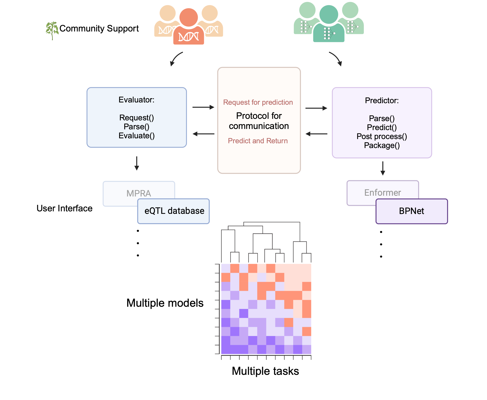

---
---
---

# Genomic Model Evaluation API

### API Reference

This Application Programming Interface (API) was designed for the functional genomics community to create seamless communication across pre-trained models and genomics datasets. It is a product of the feedback from many model and dataset experts and our hope is that it allows for long-lasting benchmarking of models. Models and datasets communicate via a set of predefined protocols through APIs. The common protocol enables any model to communicate with any dataset (although not all combinations may make sense).

The evaluators (dataset APIs) will make prediction requests in the standard format to the predictors (model APIs), which then return the predictions to the Evaluator in a standard format, enabling the evaluators to calculate the model’s performance. Each of the evaluators and predictors will be containerized using Apptainer.

The communication protocol below covers some of the mandatory parameters required for the API. There are also some optional parameters for specific prediction requests. 

For this effort to succeed we encourage data and model experts to provide us with feedback and support (via contributing evalutors and predictors). Since dataset creators are the experts in their dataset, they are most qualified to decide how these models should be evaluated on their data. Meanwhile, model creators are best qualified for deciding how the model should be used for the inference tasks. Accordingly, the responsibilities for adding the new datasets and models would fall on their creators. Once they set up the intial Being able to easily compare results across different datasets and models would accelerate the improvement of genomics models, motivate novel functional genomic benchmarks, and provide a more nuanced understanding of model abilities.

If you would like to be involved we encourage you to use this API with your own models and datasets and submit to the Github repo list (add link). If you have critiques or feedback please reach out to [ishika.luthra\@ubc.ca](mailto:ishika.luthra@ubc.ca). 

### Communication protocol

Using the standardized communication format each Predictor will receive information in the same format from any evalutor. Each Predictor also returns the predictions in the same format which enables the community to easily compare different model's predictions for the same dataset or evaluate a model on multiple different types of datasets very quickly. 

The only files that are exchanged between the evaluators and predictors are .json files, a commonly used file format for sending and receiving information in a standard format. Data in the .json files is stored in the following format: `"keys": "value"`, where the value can be strings, numbers, objects, arrays, booleans or null. We have outlined below the mandatory "keys" required for communication between the Evaluator and Predictor to occur. Certain "keys" have a fixed set of "values" that can be used while others are up to the evaluators. API specifications can be found here: 

The files and communication between APIs is done using python sockets. Scripts for these can be found in `/src/training_examples/TCP_example`.

Examples of Evaluator and Predictor messages can be found in `/example_JSON_files` folder. Formats for json files can be checked using the following link: https://jsonformatter.curiousconcept.com

Examples of containerized evaluators and predictors can be found in `/src` folder. 

#### Communication protocol example

P: Hi my name is "Predictor"! My job is to wait and listen for a "Evaluator" to ask me to do something.

E: Hello I'm an "Evaluator"! I'm sending you a .json file, could you please predict the accessbility of these sequences?

P: Sure thing :) One moment please...

P: Psst! Hey CellMatcher! I was asked for cellX, but I have no clue that that is, can I have a little help?

CM: Sure thing! cellX is similar to your cellY, so you should use that for your predictions instead. 

P: Here you go, Evaluator - i'm sending you a .json file back with all the predictions for cellY.

### To test a basic TCP socket connection using Python scripts

https://github.com/de-Boer-Lab/Genomic-Model-Evaluation-API/tree/main/src/training_examples/TCP_example

### Instructions for how to create a sample Evaluator and Predictor containers

The example in the folder outlines an easy test communication between an Evaluator (with random sequences) and a Predictor (that will generate random predictions for any task you request). 

https://github.com/de-Boer-Lab/Genomic-Model-Evaluation-API/tree/main/src/training_examples/Apptainer/Test_Evaluator_Predictor

### Containerizing evaluators and predictors

We have created a Predictor for one of the DREAMRNN models (Rafi et. al 2024). Detailed instructions can be found here: https://github.com/de-Boer-Lab/Genomic-Model-Evaluation-API/tree/main/src/DREAM_RNN 

A sample Evaluator for MPRA sequences from Gosai et. al (2024) and instructions for how to build it can be found here: https://github.com/de-Boer-Lab/Genomic-Model-Evaluation-API/tree/main/src/Gosai_2024_Evaluator

| Evaluator     | Zenodo Download link|Description |
| ----------- | ----------- | ----------- |
| Gosai MPRA      |        |  Gosai et al. (2024), https://doi.org/10.1038/s41586-024-08070-z    |

| Predictor     | Zenodo Download link | Description|
| ----------- | ----------- | ----------- |
| DREAMRNN      |       |  Rafi et al. (2024), https://doi.org/10.1038/s41587-024-02414-w    |
### Collaborators

* Sara Mostafavi
  + Xinming Tu
  + Yilun Sheng
* Anshul Kundaje
  + Surag Nair
  + Soumya Kundu
  + Ivy Raine
  + Vivian Hecht
* Brenden Frey
  + Alice Gao
  + Phil Fradkin
* Graham McVicker
  + Jeff Jaureguy
  + David Laub
  + Brad Balderson
  + Kohan Lee
  + Ethan Armand
* Hannah Carter
  + Adam Klie
* Maxwell Libbrecht
* Ivan Kulakovskiy
  + Dima Penzar
  + Ilya Vorontsov
* Vikram Agarwal
* Peter Koo
* Ziga Avsec
* Jay Shendure
  + CX Qiu
  + Diego Calderon
* Julien Gagneur
  + Thomas Mauermeier
* Sager Gosai
* Andreas Gschwind
* Ryan Tewhey
* David Kelley
* Georg Seelig
* Gokcen Eraslan
* Jesse Engreitz
* Jian Zhou
* Julia Zeitlinger
* Kaur Alosoo
* Luca Pinello
* Michael White
* Rhiju Das
* Stein Aerts

